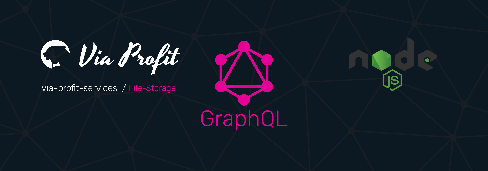

# Via Profit services / File-Storage



> Via Profit services / **File-Storage** - это пакет, который является частью сервиса, базирующегося на `via-profit-services` и представляет собой реализацию схемы для хранения каких-либо файлов, изображений и прочих документов.


## TODO

- [ ] трансформации типа Crop и кадрирование при создании изоражения
- [ ] Описание методов класса сервиса
- [ ] CONTRIBUTING docs
- [ ] Тесты
- [ ] Subscriptions

## Содержание

- [Зависимости](#dependencies)
- [Установка и настройка](#setup)
- [Как использовать](#how-to-use)
- [Подключение](#integration)
- [Параметры](#options)

## <a name="dependencies"></a> Зависимости

- [Jimp](https://www.npmjs.com/package/jimp) - Трансформации с изображениями
- [Imagemin](https://github.com/imagemin/imagemin) - Сжатие изображений

## <a name="setup"></a> Установка и настройка

### Установка

```bash
yarn add ssh://git@gitlab.com:via-profit-services/file-storage.git#semver:^0.7.0
```

Список версий [см. здесь](https://gitlab.com/via-profit-services/file-storage/-/tags)

### Миграции

После первой установки примените все необходимые миграции:

```bash
yarn knex:migrate:latest
```

После применения миграций будут созданы все необходимые таблицы в вашей базе данных

## <a name="how-to-use"></a> Как использовать

Модуль определяет скалярный тип **FileUpload** для представления загружаемого файла согласно спецификации [GraphQL multipart request specification](https://github.com/jaydenseric/graphql-multipart-request-spec)\_. Помимо самого скаляра FileUpload, модуль модифицирует GraphQL запрос таким образом, что в конечный резолвер будет передан объект `files` в виде аргумента, который будет содержать массив промисов. Каждый промис - это загружаемый файл, который резолвит объект содержащий:

 - createReadStream - WriteStream  из [fs-capacitor](https://github.com/mike-marcacci/fs-capacitor#readme)
 - mimeType - Тип файла
 - filename - Имя файла

Для чтения файла необходимо вызвать функцию `createReadStream` полученную из промиса. Функция вернет ReadStram, расширенный от [NodeJS ReadStream](https://nodejs.org/api/stream.html#stream_new_stream_readable_options)

Полученный файл можно записать на диск самостоятельно, либо использовать метод `createFile` класса `FileStorage`.

Пример загрузки файлов:

_./schema.graphql_

```graphql
extend type Mutation {
  upload(files: [FileUpload!]!): File!
}

```

_./resolvers.ts_

```ts
import { IResolvers } from 'graphql-tools';
import path from 'path';
import { IContext } from '@via-profit-services/core';
import { IFile, FileStorage } from '@via-profit-services/file-storage';

interface UploadArgs {
  files: IFilePayload[];
}

const resolvers: IResolvers<any, IContext> = {
  Mutation: {
    upload: async (parent, args: UploadArgs, context) => {
      const { files } = args;
      const filesData = await Promise.all(files);
      const fileStorage = new FileStorage({ context });

      filesData.map(async (file) => {
        const { createReadStream, mimeType } = file;
        const fileData = await fileStorage.createFile(createReadStream(), {
          category: 'photo',
          mimeType,
        });

        console.log('files was saved as', fileData);
      });
    },
  },
};

export default resolvers;
```

_./curl.sh_

```sh
#!/bin/bash

curl http://localhost:3005/graphql \
  -F operations='{ "query": "mutation ($files: [FileUpload!]!){upload(files: $files)}", "variables": { "files": [null] } }' \
  -F map='{ "0": ["variables.files.0"] }' \
  -F 0=@/path/to/file.txt
```

В экспортируемой схеме присутствуют GraphQL типы `File` и `Image`. Эти типы содержат информацию о загруженных файлах. При запросе изображений возможно применить модификаторы трансформаций, например:

```graphql
query {
  fileStorage {
    image(
      id: "be44e49f-2318-45cc-9e3c-47f1aee91f4d"
      transform: { blur: 4, greyscale: true, scaleToFit: { width: 300, height: 300 } }
    ) {
      url
    }
  }
}
```

В примере выше, сервер сформирует ссылку на запрашиваемое изображение. После первой загрузки картинки она будет отправлена в кэш (см параметр [cachePath](#options-cachePath)). Все загружаемые файлы помещаются в директорию статических файлов ([storagePath](#options-storagePath)), поэтому, если запросить картинку буз модификаторов трансформаций, то будет возвращена ссылка именно на исходное изображение из директории статических файлов.

### <a name="integration"></a> Подключение

Для интеграции модуля требуется задействовать типы и резолверы модуля, затем необходимо подключить Express middleware, поставляемое пакетом. Так же необходимо сконфигурировать логгер.

Модуль экспортирует наружу:

- [Jimp](https://github.com/oliver-moran/jimp#readme)
- configureFileStorageLogger - Функция конфигурации логгера
- makeSchema - Функция, результатом работы котрой является объекс, содержащий:
  - typeDefs - служебные Типы
  - resolvers - Служеюные Резолверы
  - FileStorage - Класс, реализующий модель данного модуля

Пример подключения:

```ts
import { App } from '@via-profit-services/core';
import { makeSchema } from '@via-profit-services/file-storage';

const fileStorage = makeSchema({
  staticPrefix: '/static',
});

const app = new App({
  ...
  typeDefs: [
    fileStorage.typeDefs,
  ],
  resolvers: [
    fileStorage.resolvers,
  ],
  expressMiddlewares: [
    fileStorage.expressMiddleware
  ]
  ...
});
app.bootstrap();

```

## <a name="options"></a> Параметры

| Параметр                                                   |  Тип   | Обязательный | По умолчанию                 | Описание                                                                                                                                                                                                                       |
| ---------------------------------------------------------- | :----: | :----------: | ---------------------------- | ------------------------------------------------------------------------------------------------------------------------------------------------------------------------------------------------------------------------------ |
| staticPrefix                                               | string |     Нет      | `/static`                    | Префикс статического пути (подробнее [https://expressjs.com/ru/starter/static-files.html](https://expressjs.com/ru/starter/static-files.html))                                                                                 |
| <a name="options-storagePath"></a>storagePath              | string |     Нет      | `./public/fileStorage/files` | Путь до директории статических файлов. Не используйте абсолютный путь - только относительный (подробнее [https://expressjs.com/ru/starter/static-files.html](https://expressjs.com/ru/starter/static-files.html))              |
| <a name="options-cachePath"></a>cachePath                  | string |     Нет      | `./public/fileStorage/cache` | Путь до директории хранения кэша. Не используйте абсолютный путь - только относительный                                                                                                                                        |
| hostname                                                   | string |     Нет      | `http://localhost:80`        | Имя хоста для формирования URL-адреса файлов                                                                                                                                                                                   |
| imageOptimMaxWidth                                         | number |     Нет      | `800`                        | Максимально допустимая ширина изображения. Все загружаемые изображения будут уменьшены до данного значения, но только в том случае, если ширина изображения превышает заданную величину                                        |
| imageOptimMaxHeight                                        | number |     Нет      | `600`                        | Максимально допустимая высота изображения. Все загружаемые изображения будут уменьшены до данного значения, но только в том случае, если высота изображения превышает заданную величину                                        |
| compressionOptions                                         | object |     Нет      |                              | Объект настроек imagemin плагинов                                                                                                                                                                                              |
| compressionOptions.mozJpeg                                 | object |     Нет      | `{ quality: 70 }`            | [https://github.com/imagemin/imagemin-mozjpeg#readme](https://github.com/imagemin/imagemin-mozjpeg#readme)                                                                                                                     |
| compressionOptions.pngQuant                                | object |     Нет      | `{ quality: [0.8, 0.8] }`    | [https://github.com/imagemin/imagemin-optipng#readme](https://github.com/imagemin/imagemin-optipng#readme)                                                                                                                     |
| compressionOptions.optiPng                                 | object |     Нет      | `{ optimizationLevel: 3 }`   | [https://github.com/imagemin/imagemin-pngquant#readme](https://github.com/imagemin/imagemin-pngquant#readme)                                                                                                                   |


